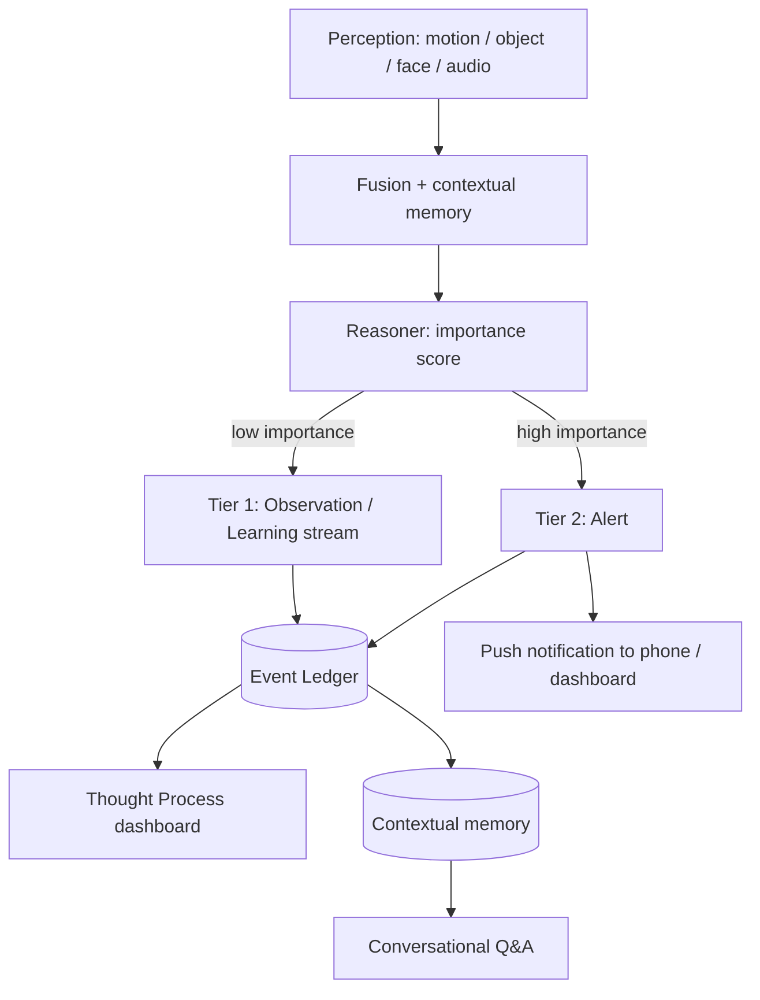
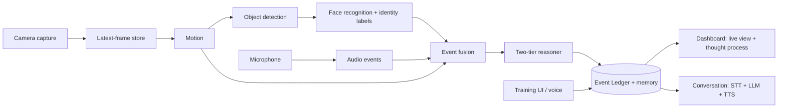

# AI Home Sentinel - Vision Roadmap

This document is the source of truth for where AI Home Sentinel is going. Every
future phase is checked against the principles and plan written here. If a new
feature does not move us toward the vision below, we reconsider it.

It is written in the same beginner-friendly spirit as the
[README](README.md): plain language first, technical detail second, and never
break the system to add a feature.

This is a planning document only. It does not contain code. The code is built
one phase at a time, and each phase is validated against this roadmap.

---

## The big idea

AI Home Sentinel is not a security camera that beeps when it sees motion. The
goal is a practical, **local** AI assistant that can observe, understand, reason
about, and proactively respond to what happens in a home or business - while
staying realistic about running on a Raspberry Pi 5.

Think of it as a calm, attentive helper that watches and listens, builds an
understanding of your world over time, quietly learns your routines, speaks with
you naturally, and only interrupts you when something genuinely matters.

---

## 1. Vision and guiding principles

These are the non-negotiables. Treat this list as a checklist for every future
phase. A feature is only "done" if it respects all of them.

- **Local-first and private.** Everything runs and stays on the Pi 5. No cloud
  dependency, nothing uploaded. Your data is yours.
- **An assistant, not a passive camera.** The system should observe, understand,
  reason, and act - not just record.
- **Natural conversation is a core feature.** It should understand spoken
  language, answer with natural-sounding speech, summarize live and recorded
  footage conversationally, and let people ask questions in plain language
  instead of technical commands.
- **Multimodal fusion.** Object detection, facial recognition, motion analysis,
  audio events, and contextual memory combine into one shared understanding -
  not separate, disconnected features.
- **Proactive, not reactive.** The AI should identify important events on its
  own, recognize patterns over time, and notify the user when something
  significant happens - without being asked.
- **Predictive reasoning.** Over time it should learn routines, recognize
  unusual behavior, anticipate potential issues, and give preventative alerts
  whenever possible - solving problems before they happen, not only after.
- **Trainable and personal.** Users can teach it new faces, objects, locations,
  routines, custom labels, and preferences. It should adapt its communication
  style and personality to match the user, like a modern conversational
  assistant.
- **Two-tier transparency ("show your work").** A low-stakes observation and
  learning stream that shows how it is coming to understand you, plus a
  high-stakes alert stream for things worth interrupting you about.
- **Business-ready.** Persistent identity labels (for example, "Thief #1") that
  are remembered, auto-recognized when the person returns, and alert staff
  automatically without a manual prompt.
- **Raspberry Pi 5 realism.** Every feature must have a path that actually fits
  the hardware. If it cannot run on a Pi 5, it is redesigned until it can.
- **Never crash silently.** Matching the existing code style, a failure in one
  part becomes a clear message, not a dead system.

---

## 2. The two-tier "thought process" event model (the backbone)

This is the heart of the project, and it is a **cross-cutting concept**, not a
single late feature. Almost everything the system perceives flows through it.

### How it works

1. Every perception - motion, object, face, audio, or system event - writes one
   record to a single, unified **Event Ledger** (a SQLite database, introduced
   in Phase 3).
2. A reasoning/scoring layer reads each record, combines it with context and
   memory, assigns an **importance score**, and decides its **tier**.

### The two tiers

- **Tier 1 - Observation / Learning ("show your work").**
  Low-importance noticings and pattern-building. These stay on the dashboard
  timeline and **never** push a notification to your phone. They exist so you can
  watch the AI come to understand your world.
  - Example: "9:30 AM - Jacob left his room for the first time today."
  - Example: "Jacob waking up" (recognized from a repeating pattern).
  - Example: "Learned: the cats appear to be indoor-only."

- **Tier 2 - Alert.**
  High-importance events worth interrupting you. These push a notification to
  your phone and/or the dashboard.
  - Example: "Front door opened while a cat is right next to it."
  - Example: "Thief #1 has returned - now at the front entrance."

### What decides Tier 1 vs Tier 2 (promotion logic)

The reasoner promotes an observation to an alert based on:

- **Novelty** - is this new or unusual versus what we have seen before?
- **Identity** - is a known/flagged person or object involved (for example, a
  labeled "Thief #1")?
- **Routine deviation** - does this break a learned daily pattern?
- **Safety relevance** - could this lead to harm or loss (the open door + indoor
  cat case)?
- **User-tuned thresholds** - the user can make the system more or less
  talkative over time.

### The Event Ledger schema (locked in early)

This schema is introduced in Phase 3 and reused by every later phase, so all
signals share one structure from the start:

- `id` - unique row id.
- `timestamp` - when it happened.
- `source` - where it came from: `motion`, `object`, `face`, `audio`, `system`.
- `tier` - `1` (observation/learning) or `2` (alert).
- `importance` - a score (for example 0.0-1.0) used to decide the tier.
- `title` - short human-readable label ("Jacob waking up").
- `summary` - a longer plain-language description.
- `entities` - structured JSON of who/what was involved (people, objects, zones).
- `snapshot_path` - optional saved image for this event.
- `clip_path` - optional saved short video clip.
- `acknowledged` - has the user seen/dismissed it?
- `notified` - was a Tier 2 notification sent?

### The two-tier decision flow

---

## 3. Target architecture (where everything plugs in)

This is the shape the system grows into. Each box maps to a module (several
already exist as placeholders in `sentinel/`).

---

## 4. Phased plan (one phase at a time)

We build in small, safe phases. Each phase below lists its **goal**, the
**module(s)** it fills (matching the existing placeholders in `sentinel/`), what
**"done" looks like**, and the **Pi 5 approach**.

Numbering continues the scheme already used in the README and in
[`sentinel/dashboard.py`](sentinel/dashboard.py) (which carries `phase` and
`*_active` markers).

### Stage A - Perception foundation

#### Phase 1 - Foundation (DONE)
- **Goal:** prove the foundation works without any camera or AI.
- **Modules:** `config.py`, `health.py`, `dashboard.py`.
- **Done looks like:** one-command start, a web dashboard with live CPU/RAM/disk/
  temperature, and a `/status` JSON endpoint. (Already implemented.)
- **Pi 5 approach:** lightweight Flask app; safe config defaults.

#### Phase 2 - Camera and live video
- **Goal:** see a live picture in the dashboard.
- **Modules:** `camera.py`, `frame_store.py`.
- **Done looks like:** a single camera capture loop decodes the stream once and
  stores the newest frame; the dashboard shows live video (MJPEG); the
  `camera_active` marker turns on.
- **Pi 5 approach:** one capture loop only (Picamera2 or OpenCV); drop stale
  frames so downstream AI always gets the freshest frame.

#### Phase 3 - Motion + Event Ledger + Storage
- **Goal:** notice movement, record events, and save evidence.
- **Modules:** `motion.py`, `events.py`, `storage.py`.
- **Done looks like:** cheap background-subtraction motion detection; the
  **two-tier Event Ledger schema** (Section 2) created in SQLite; snapshots/clips
  saved with daily limits; an events page lists recorded events.
- **Critical:** lock in the Event Ledger schema here so every later signal writes
  to one shared structure.
- **Pi 5 approach:** motion runs cheaply on every frame and is the trigger that
  wakes heavier AI later.

#### Phase 4 - Object detection
- **Goal:** know *what* moved (person, dog, cat, car, ...).
- **Modules:** `detector.py`.
- **Done looks like:** YOLO-nano detections attached to events; detections only
  run when motion is active or on a low fixed interval; the `detector_active`
  marker turns on.
- **Pi 5 approach:** YOLO nano via NCNN/quantized; motion-triggered, rate-limited
  detection (not every frame).

#### Phase 5 - Face recognition + persistent identity labels
- **Goal:** know *who* it is, and remember them.
- **Modules:** `face_recognition_module.py`.
- **Done looks like:** enroll/label known people; unknown faces saved; the
  business "Thief #1" use case - a person can be labeled once and is
  **automatically re-recognized** on return, which the reasoner can promote to a
  Tier 2 alert for staff.
- **Pi 5 approach:** runs only when a person is detected; encode faces once and
  compare with a tolerance; off by default until enrolled.

### Stage B - Understanding and memory

#### Phase 6 - Contextual memory and multimodal fusion
- **Goal:** stop treating signals separately; build real understanding.
- **Done looks like:** motion, objects, faces, and audio are fused into coherent
  events and per-entity timelines (for example, "Jacob: seen 9:30 AM kitchen,
  10:15 AM front door"); memory persists across restarts.
- **Pi 5 approach:** SQLite plus a lightweight local vector store for recall;
  keep memory compact and queryable.

#### Phase 7 - Two-tier reasoner + Thought Process dashboard + notifications
- **Goal:** make the two-tier model visible and useful.
- **Done looks like:** the importance/promotion engine from Section 2; a
  **Tier 1 "show your work"** timeline UI on the dashboard; **Tier 2** push
  notifications to phone/dashboard; per-tier thresholds the user can tune.
- **Pi 5 approach:** scoring is cheap rule-based logic first, with room to add
  smarter models later.

### Stage C - Conversation

#### Phase 8 - Audio events
- **Goal:** hear important sounds, not just see motion.
- **Done looks like:** sound classification (for example glass breaking, a dog
  barking, raised voices) writes records into the Event Ledger like any other
  signal.
- **Pi 5 approach:** small on-device audio classifier; event-driven.

#### Phase 9 - Natural conversation
- **Goal:** talk with the system in plain language.
- **Done looks like:** speech-to-text in, natural speech out, conversational
  summaries of live and recorded footage, and the ability to ask questions about
  what happened ("Who came by this afternoon?") answered from memory.
- **Pi 5 approach:** local STT (whisper.cpp tiny/base), local TTS (Piper), and a
  small quantized local LLM (~1-3B via llama.cpp). This is the most demanding
  component, so it runs on demand with an optional fallback path.

### Stage D - Proactive and predictive

#### Phase 10 - Routine learning and proactive detection
- **Goal:** learn what "normal" looks like and surface it.
- **Done looks like:** the system learns daily patterns and emits Tier 1
  learnings ("Jacob waking up") on its own, and promotes clear deviations to
  Tier 2.
- **Pi 5 approach:** lightweight statistics over the Event Ledger; no heavy
  training loops.

#### Phase 11 - Predictive reasoning and preventative alerts
- **Goal:** anticipate problems before they happen.
- **Done looks like:** anomaly detection and anticipation - for example, the
  indoor-cats-plus-open-door case that produces a preventative Tier 2 alert
  before the cat gets out.
- **Pi 5 approach:** rule + pattern based prediction first, expanded carefully.

### Stage E - Personalization

#### Phase 12 - Trainability and personalization
- **Goal:** let the user teach and shape the assistant.
- **Done looks like:** teach new faces, objects, locations, routines, custom
  labels, and preferences through the dashboard and by voice; the assistant
  adapts its communication style and personality to the user over time.
- **Pi 5 approach:** store preferences locally; personalization is configuration
  and prompt/style adjustments, not constant retraining.

---

## 5. Raspberry Pi 5 realism notes

- An 8GB Pi 5 is recommended. Heavy AI (object detection, face recognition, the
  conversational LLM) runs on triggers or on demand - never on every frame.
- Model choices that fit the hardware:
  - **Object detection:** YOLO nano via NCNN (quantized) for speed.
  - **Faces:** lightweight face embeddings, compared only when a person is seen.
  - **Speech-to-text:** whisper.cpp tiny/base.
  - **Text-to-speech:** Piper.
  - **Conversation LLM:** a small quantized model (~1-3B via llama.cpp). This is
    the most demanding piece; expect it to be on-demand, and keep an optional
    fallback path in mind.
- **Memory/recall:** SQLite plus a lightweight local vector extension keeps
  everything on-device and queryable.
- The golden rule: motion is the cheap, always-on trigger; everything expensive
  wakes up only when there is a reason to.

---

## 6. Glossary

- **Event Ledger** - the single SQLite table where every noticed thing is
  recorded, with a tier and an importance score. The shared memory of the system.
- **Tier 1 (Observation / Learning)** - low-stakes noticings shown on the
  dashboard to "show the AI's work." Never sends a phone notification.
- **Tier 2 (Alert)** - high-stakes events worth interrupting you about. Sends a
  notification.
- **Fusion** - combining several signals (motion + object + face + audio) into a
  single, coherent event instead of separate beeps.
- **Routine** - a repeating pattern the system learns over time (for example,
  "Jacob wakes up around 9:30 AM").
- **Anomaly** - something that breaks a learned routine or looks unusual, which
  may be promoted to an alert.
- **Embedding** - a compact numeric "fingerprint" of a face, object, or piece of
  text used to compare and recall similar things quickly.
- **Importance score** - a number the reasoner assigns to an event to decide
  whether it is Tier 1 or Tier 2.

---

## A note on discipline

We build **one phase at a time**. Each phase should leave the system working,
beginner-runnable, and a little smarter than before - always pointed at the same
goal: an intelligent, trainable, proactive assistant, not a collection of
disconnected features.
